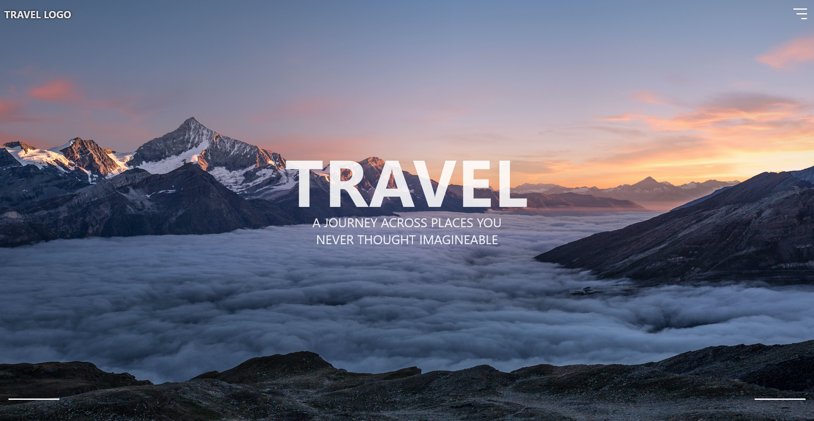

# TRAVEL SITE TEMPLATE: SVELTE + VITE
;

My first ever time creating a simple static website utilizing Svelte 

## What it Contains

- Simple one page website
- Images from **unsplash.com**
- Functioning Nav Bar "**Links not included**"
- Responsive layout
- Svelte imported animations

- ```<Queries/>``` directed to HTML DOM manipulation
- ```Svelte:window bind:scrollY``` for animation on scroll

## Overall

Simple Svelte + JS website

Nothing ground breaking but a good start to getting to know a new framework for future use.
 

